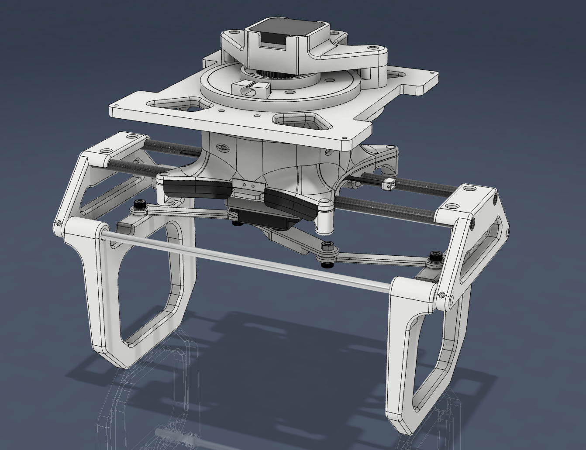
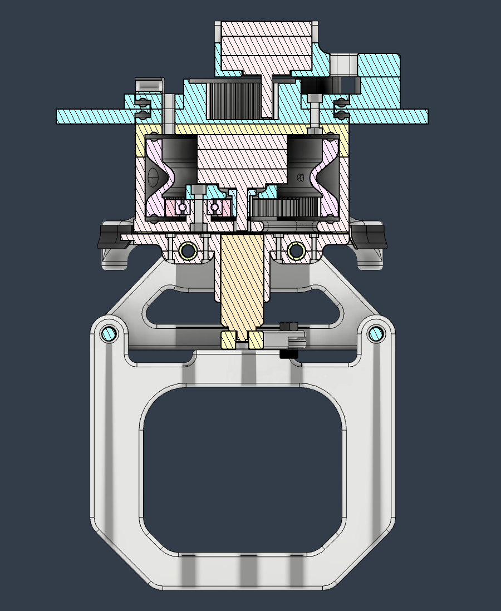
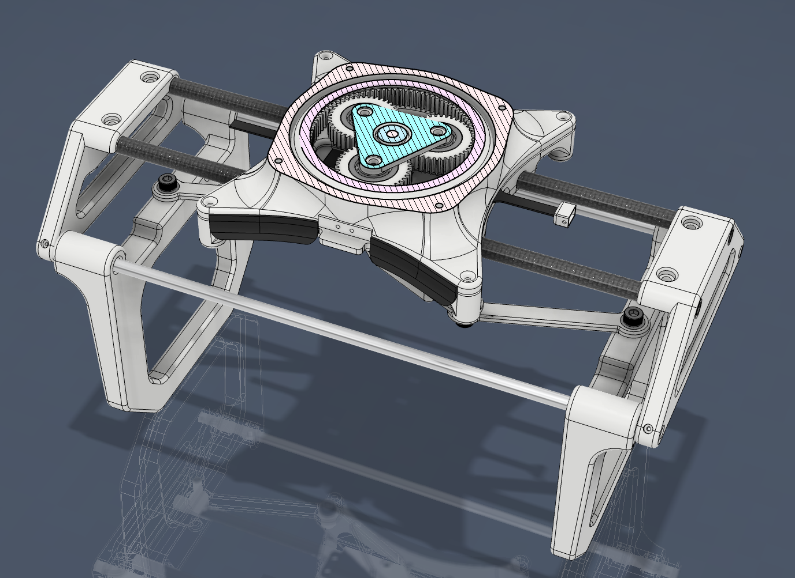

# Drone Package Gripper \& Winch

I created this winch/gripper for the AEAC 2022 student competition in which the design team placed first. It featured a planetary gearbox for the winch system increasing torque.

Movements:
- Rotation about the vertical axis for gripper
- Vertical position of gripper with winch system
- Position of gripper claws

Components:
- Arduino Nano
- Two stepper motors
- One servo motor
- End stops
- RX and RC for remote operation

## CAD Renders

Here are the CAD renders showing different views of the gripper and winch system:

## Actual Implementation

Here are photographs of the gripper and winch system in action:

